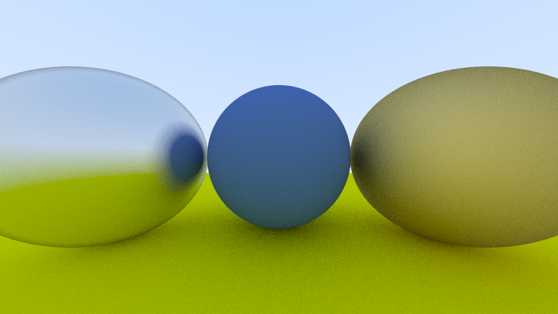
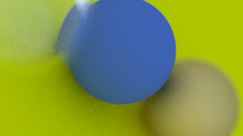
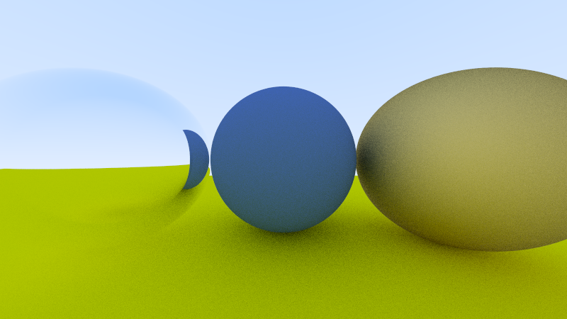
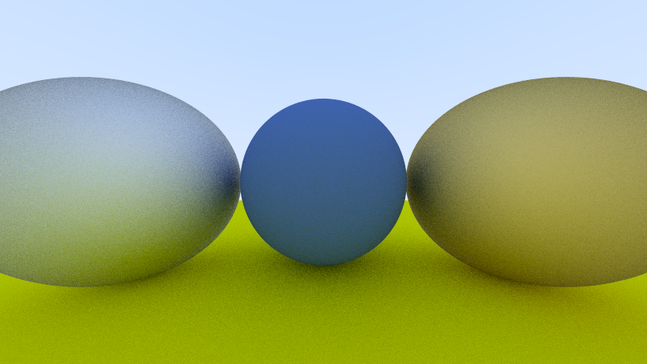
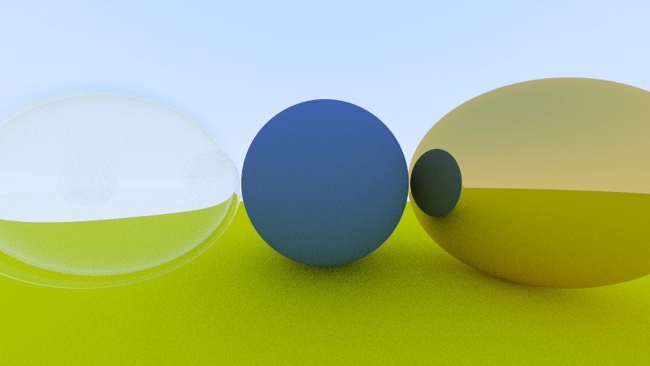

# Raytracer

A raytracer is a 3D rendering algorithm that is significantly different from the rendering algorithms used in the video game industry. This rendering method, known as "ray tracing," works by calculating intersections and is very demanding in terms of computational power, making it unsuitable for real-time rendering. However, it allows for near photo-realistic rendering, making it the preferred method for special effects in movies, for example.


## Demo








## Usage/Examples

you can use the configurations files in the directory "scenes" to test this project

```bash
./raytracer scenes/scene2.cfg
```


## Authors

- [@AxsOne](https://github.com/AxsOne)
- [@elhackordelamuerte](https://github.com/elhackordelamuerte)
- [@darkcat974](https://github.com/darkcat974)

